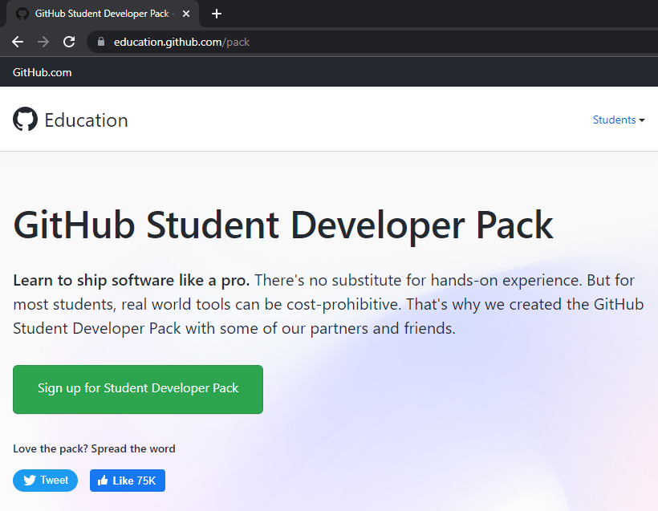
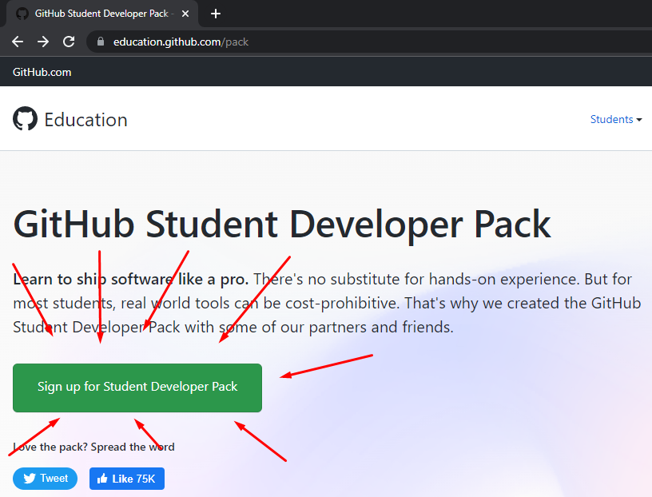
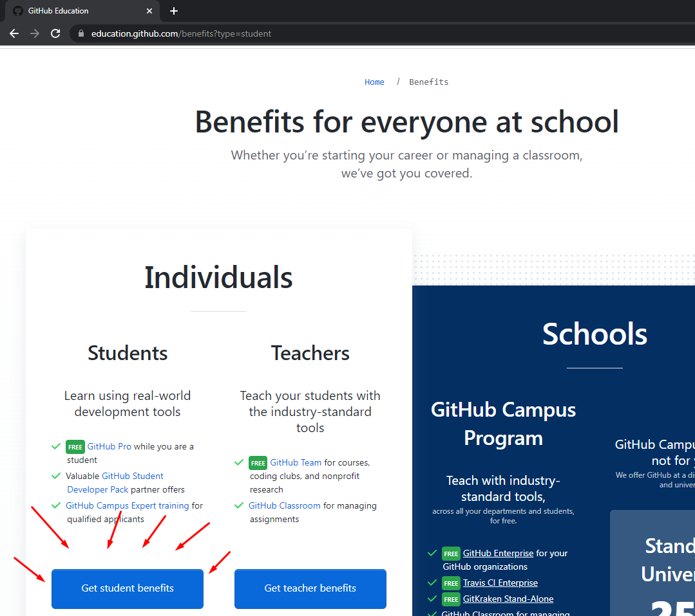
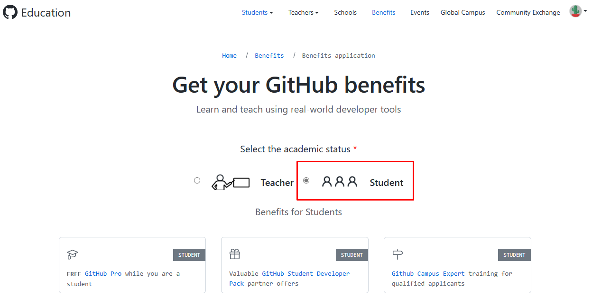
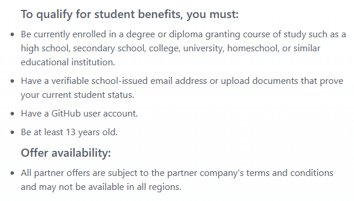
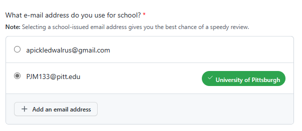
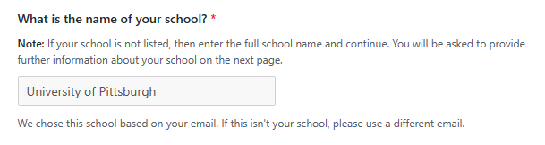
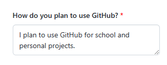

# ENGCMP0600 Writing Practice #2 Directions in Markdown
This assignment is to practice writing official instructions by creating a guide on a topic chosen by the student.
Stratgies presented in class (and in the textbook) are to be utilized.

# How to Sign Up for GitHub Education's Student Developer Pack
The goal of this guide is to help students new to GitHub sign up for the Student Developer Pack offered by the platform.
This pack gives students access to industry leading technologies and services.

From professional integrated development environments (IDEs, advanced code editors)
to powerful cloud computing platforms, there are many offers to take advantage of!

## Step 1

First, if you haven't already [sign up](https://github.com/signup) for a [GitHub](https://github.com/) account.

## Step 2

Go to GitHub Education's Student Developer Pack page (*see figure below*).
It can be accessed at [https://education.github.com/pack](https://education.github.com/pack).

## Step 3

Click the green button (*see figure below*) to sign up for the Student Developer Pack.

## Step 4
Click the blue button labeled `Get student benefits` (*see figure below*).
You may have to scroll down the page to find the button.

## Step 5
You will be brought to a page like the one shown below.
Select the option labeled `Student` (*see figure below*).

## Step 6
Read the requirements (*see figure below*) and ensure that you meet them.

## Step 7
Select your university email from the list of emails (*see figure below*) linked to your account.
If you do not have a university email, select the primary email associated with your account.

*NOTE: University provided emails will get you faster approval (notice how my Pitt email is verified).*

## Step 8
Enter the name of your university in the next field (*see figure below*).
If you chose a university affiliated email address, this field may be automatically filled.

## Step 9
The final field (*see figure below*) will ask you *how* you plan to use GitHub.
Generally, a generic response will suffice, like the one pictured below.

## Step 10
Click the green `Continue` button. The site will ask you for your current location.
Do not worry if you are not at your university (you may just have a longer review period).

In some cases, GitHub may ask you for an **official document** to verify your status as a student.
If this occurs, a simple photo of your **student identification card** will suffice.

# Step 11
This part is easy: *just wait!*
It shouldn't take more than few business days for you to be approved.

# Step 12
Now that you are approved, you can enjoy your benefits. Go **wild**!
